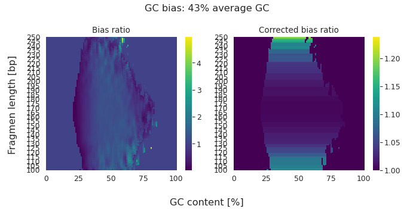

# cfDNA GCcorrection <!-- omit in toc -->

- [Introduction](#introduction)
- [Documentation:](#documentation)
    - [Installation](#installation)
    - [Quickstart](#quickstart)
        - [Executing computeGCBias_readlen](#executing-computegcbias_readlen)
        - [Executing correctGCBias_readlen](#executing-correctgcbias_readlen)
        - [Getting required Files/parameters](#getting-required-filesparameters)
- [Example](#example)
- [Acknowledgment](#acknowledgment)


## Introduction

cfDNA_GCcorrection is an easy-to-use tool to determine and correct GC biases in cell-free DNA (cfDNA) samples. Based on fragment length and GC distributions, it calculates read-level correction values and makes them available as tags in SAM/BAM format. This additional information can be used during signal extraction in various metrics (e.g., allelic balance, coverage, read ends/midpoints, WPS), while preserving the original read coverage patterns for specific analyses.


## Documentation:

### Installation

**Install by cloning this repository:**

You can install cfDNA_GCcorrection on command line (linux/mac) by cloning this git repository :

``` bash
$ git clone https://github.com/kircherlab/cfDNA_GCcorrection.git
$ cd cfDNA_GCcorrection
$ pip install -e .
```

### Quickstart

The GCbiascorrection described in this repo works in two steps.

#### Executing computeGCBias_readlen

First the GC bias is calculated with the help of the `computeGCBias_readlen` script, which returns a tab-separated file containing the expected, observed GC x readlenght distribution and the ratio of these mesures.

Given a `.bam` file with WGS data from a liquid biopsy and a genome reference in `.2bit` format:

```bash
computeGCBias_readlen -b <INPUT BAMFILE> \
    --effectiveGenomeSize <EFFECTIVEGENOMESIZE> \
    -g <2BIT GENOME> \
    -I \
    -p <NUMBER OF CPU CORES> \
    --GCbiasFrequenciesFile <GCBIAS_OUTPUT_FILE>
```

For more options use the `--help` flag.

#### Executing correctGCBias_readlen

The second step uses these precomputed values to compute correction values and attach them as bam/sam tag to each read according to its length and GC content. This can be done by executing the `correctGCBias_readlen` with the output of the previous script.

```bash
        correctGCBias_readlen -b <INPUT BAMFILE> \
        --effectiveGenomeSize <EFFECTIVEGENOMESIZE> \
        -g <2BIT GENOME> \
        --GCbiasFrequenciesFile <GCBIAS_OUTPUT_FILE> \
        -p <NUMBER OF CPU CORES> \
        -w \
        -o <GCWEIGHTED_OUTPUT_BAM>
```

For more options use the `--help` flag.

#### Getting required Files/parameters

**Effective genome size**:

The effective genome size is the portion of the genome that is mappable. This parameter will be used for creating the sampling distribution.

The most used values are: 

| Genome | Effective size |
|--------|----------------|
| GRCh37 | 2864785220     |
| GRCh38 | 2913022398     |

A more extensive documentation on determining the effective genome size can be found [here](https://deeptools.readthedocs.io/en/latest/content/feature/effectiveGenomeSize.html).

**getting 2bit genome files** :

2bit versions of the most common genomes can be downloaded from [UCSC](http://hgdownload.cse.ucsc.edu/gbdb/) and are indicated by the `.2bit extension`.

If the genome file is not available  fasta files can be converted to 2bit  by using [faToTwoBit](http://hgdownload.cse.ucsc.edu/admin/exe/).

## Example

In recent years, many approaches were developed to extract information from cfDNA. Methods range from identification of allelic differences at known disease markers, coverage alterations indicative of structural changes in tumor tissues, fragmentation differences to measuring methylation state. These methods measure different signals, but all rely on the quantification of read distributions and subtle changes in read recovery affect their results.

A common bias in sequencing and DNA library preparation is related to the Guanine+Cytosine (GC) content of fragments, leading to under- or overrepresentation of certain read populations (Fig 1).

<figure>
  
  <figcaption><strong>Figure 1.  Measurement of GC biases in cfDNA data.</strong>  Heatmaps show the theoretical fragment representation in genome (left),
distribution in the sample (middle) and the ratio (right).</figcaption>
</figure>
<br><br>

From these values we can calculate readlength and GC dependent correction values, which can be used as weights fro each read. A correction of over- and underrepresented reads in a sample with an average GC content of 43% can be seen in Figure 2, showing the uncorrected ratio of Figure 1 on the left and the corrected ratio on the right.

<figure>
  
  <figcaption><strong>Figure 2.  GC bias ratio before and after correction.</strong>  Shown is the ratio as in Figure 1 after the initial analysis of the sample (left) and after applying the respective correction (right).</figcaption>
</figure>
<br><br>


One potential application is signal extraction around transcription afctor binding sites (TFBS). Firgure 3 shows the coverage signal around the TFBS of LYL1, a transcription factor associated with hematopoiesis. 

Figure 3 shows the compound signal of the LYL1 TFBS from normalized coverage. The expected signal is shown on the left side (sample with 41% average GC), with higher coverage in close flanking regions and a drop in coverage at the TFBS indicative of higher accessibility compared to regional background. The signal on the right side of the plot (sample with 43% average GC) is distorted due to a technical GC bias, but can be rescued by applying our correction values.

<figure>
  
  <figcaption><strong>Figure 3. Effects of GC bias correction on coverage signals from cell-free DNA.</strong>  Effects of GC bias correction in cfDNA samples with different GC contents illustrated for an overlay of experimentally identified binding sites of the transcription factor LYL1.</figcaption>
</figure>
<br><br>

## Acknowledgment

cfDNA_GCcorrection started as a fork of [deepTools](https://github.com/deeptools/deepTools), which was used as a skeleton for developing a GCcorrection method tailored towards cell-free DNA samples.
